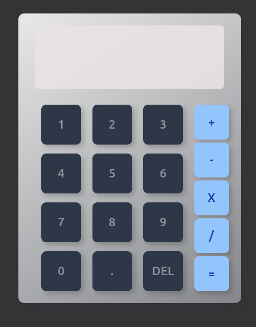

 
 

 # Description
This is a simple calculator application built as part of The Odin Project's curriculum. It allows users to perform basic arithmetic operations such as addition, subtraction, multiplication, and division.

## Time Spent 🕓

I spent a total of **10 hours and 27 minutes** working on this project, distributed over **3 days**.

**Still working on shortening the Implemintation period ☺️**

| Day | Time Spent |
| --- | :---: |
| 1 | 5 hours and 18 minutes |
| 2 | 4 hours and 12 minutes |
| 3 | 0 hours and 57 minutes |

## Technologies Used

- HTML
- CSS
- JavaScript

## Demo

You can view a live demo of the calculator application [here](https://your-github-username.github.io/calculator).
